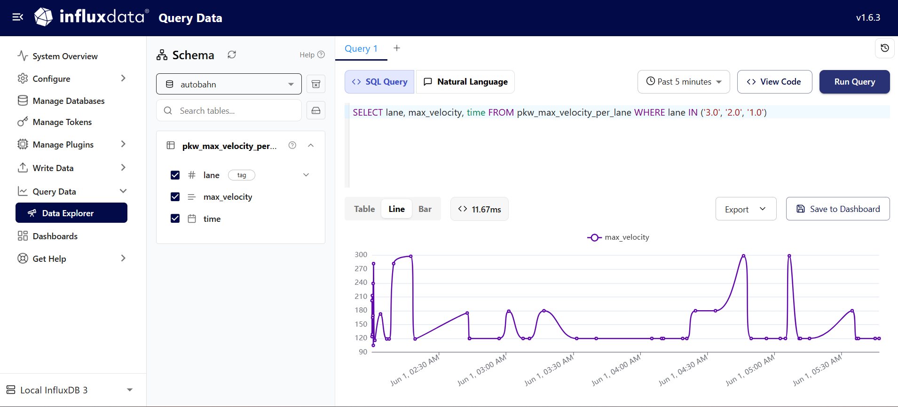

# pushpushpush
Pushpushpush is a real-time observability platform using isda_streaming, InfluxDB, and Grafana to ingest, process, and visualize high-volume data streams.

## Requirements
- Python 3.8 or higher
- uv

## Setup
1. Start the InfluxDB using Docker Compose:
```bash
docker-compose up -d
```
2. Create an admin token for InfluxDB to grant access to the database:
```bash
# With Docker — in a new terminal:
docker exec -it influxdb3 influxdb3 create token --admin
```
- Store the generated token in .env file:
```bash
INFLUXDB3_AUTH_TOKEN="your_generated_token_here"
```
3. Optional: Pre-configure the database connection in `config/config.json` for the explorer:
```json
{
  "DEFAULT_INFLUX_SERVER": "http://influxdb3:8181",
  "DEFAULT_INFLUX_DATABASE": "testdb",
  "DEFAULT_API_TOKEN": "your_generated_token_here",
  "DEFAULT_SERVER_NAME": "Local InfluxDB 3"
}
```
- This can be configured via the ui as well. [See more](https://docs.influxdata.com/influxdb3/explorer/install/?t=Docker+Compose)

## Usage
To run the example script that writes `pkw_max_velocity_per_lane` data to InfluxDB, use the following command:
```bash
uv run python scripts/write_max_vel_autobahn.py
```

## Testing
To run the tests, use the following command:
```bash
uv run pytest tests/
```

## Tools
- [isda_streaming](https://dima.gitlab-pages.tu-berlin.de/isda/isda-streaming/isda_streaming.html): A simple data streams management system implemented by the ISDA team at TU Berlin to practice working with data streams. It provides a simple API to create and manipulate data streams, as well as to implement various dataflow pipelines.
- InfluxDB 3 Core: A time-series database designed for high-performance data ingestion and querying, making it ideal for storing and analyzing real-time data streams.
- Grafana: A powerful data visualization tool that allows users to create interactive dashboards for monitoring and analyzing data streams.